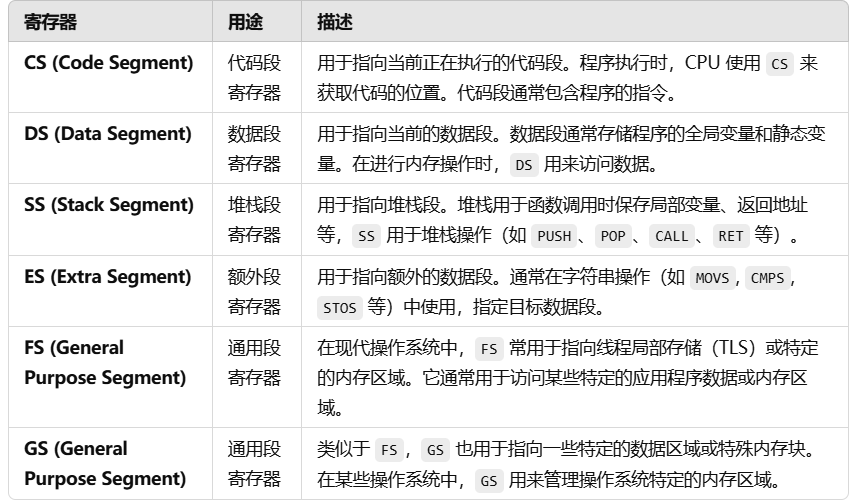

# 序言
**问题1**：什么是裸机？
裸机是指直接运行在硬件上的软件，没有操作系统的支持或中介。裸机编程通常指直接与硬件打交道，不通过操作系统提供的抽象层来访问硬件资源。裸机应用直接控制硬件，处理器的所有任务（如输入输出、存储管理、设备控制等）都由程序员在代码中实现。
**问题2**：什么是操作系统？
操作系统是一个管理计算机硬件与软件资源的系统软件，它提供了硬件抽象层，允许应用程序以更高的抽象级别运行。操作系统负责资源的管理与调度，包括CPU时间、内存分配、硬盘存储、外设控制、网络通信等。操作系统的目标是简化应用程序的开发，提供丰富的服务和接口，使开发者能够关注应用程序的业务逻辑而非底层硬件的细节。
* 方便我们使用硬件资源，如使用显存、内存等
* 高效使用硬件，如打开多个终端(窗口)
功能：CPU管理、内存管理、终端管理、磁盘管理、文件管理、网络管理、电源管理、多核管理

**问题三**如何学习？
1. 理解操作系统的运转
2. 理解标准函数的功能

**汇编基础** 段基址与偏移量取址
每个段的基址是按16字节对齐的(这与段大小无关)，因此CS寄存器的值必须左移4位（即乘以16），以得到正确的段基址，进而与IP寄存器的值相加，形成一个完整的物理地址。而偏移地址的范围位0x0000~0xFFFF即64K
**段的概念只是逻辑上**，并不代表真的将内存分为一个个段每个64k进行划分，段与段之间可以重叠，即一个同一个地址可以被不同段基址来得到;
0x表示16进制
 0x0001|  段1  |
 0x0002|  段2  |
 0x0003|  段3  |
 如果某块物理内存地址在段2的0x1000，IP=0x1000，物理地址：0x1000*16+0x1000=0x11000

**术语**：
十六位寄存器：16个二进制寄存器，或者四个16进制寄存器；0x0000~0xffff
BS：Base Register;基址寄存器
SI:Source Index;源索引寄存器,用于字符串处理和内存拷贝等操作，指向源操作数的内存地址
DI:Destination Index;目标索引寄存器,表示目的地址，特别是在字符串或内存拷贝操作中，指向目标位置。

基址与段地址的区别：
基址地址：内存中某个具体数据、指令或段的起始地址。直接以物理地址或寄存器形式表示。
BX、SI、DI 等寄存器通常用于存储基址。也可以直接用于表示内存地址的偏移量
段地址：指向内存中的一个段，表示段的基址。需要与偏移量组合才能计算出实际物理地址。
CS、DS、SS、ES、FS、GS 段寄存器用于存储段地址。
**寄存器（取8个）介绍**：（按机器语言中寄存器编号顺序排列）
CS--Code Segment Register 代码段寄存器
AX--accumulator，累加寄存器
CX--counter，计数寄存器
DX--data，数据寄存器
BX--base，基址寄存器
SP--stack pointer，栈指针寄存器
BP--base pointer，基指针寄存器
SI--source index，源地址寄存器
DI--destination index，目的变址寄存器
ES--Extra Segment Register，额外段寄存器
以上均为16位寄存器。虽然说每个寄存器都能进行相应的计算，但由于设计的原因，在某些功能用指定的寄存器，可以让机器码更简洁，如：
ADD CX,0x1234 -> 81 C1 34 12
ADD AX,0x1234 -> 05 34 12
另外八个8位寄存器：
AL--累加寄存器低位（accumulator low）
CL--计数寄存器低位（counter low）
DL--数据寄存器低位（data low）
BL--基址寄存器低位（base low）
AH--累加寄存器高位（accumulator high）
CH--计数寄存器高位（counter high）
DH--数据寄存器高位（data high）
BH--基址寄存器高位（base high）
之前16位寄存器中，0-7位为低位，8-15位为高位。当然，BP、SP、SI、DI不区分低位和高位。

### 汇编指令
INT指令为软件中断指令，就是用来调用BIOS各种函数的指令（此处作者建议先看成函数调用）。INT后面数字标识不同的函数。
REP：重复执行接下来的字符串操作指令，直到计数寄存器（CX 或 ECX）的值为 0。
MOVW：是 MOV 指令的一个变体，表示将 字（Word） 数据从源操作数移动到目标操作数。MOVW 操作的是 16 位数据（即 2 字节）。
MOVW 将DS：SI的内容送至ES：DI，分别指向内存中的源和目标地址。
jmpi:间接跳转， jmpi ip + cs