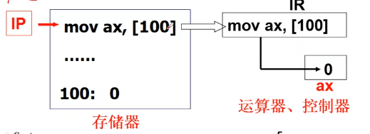
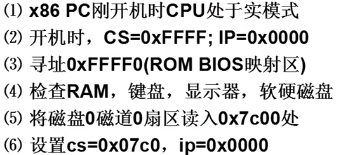
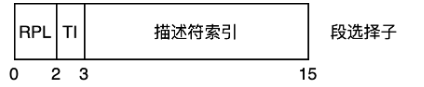
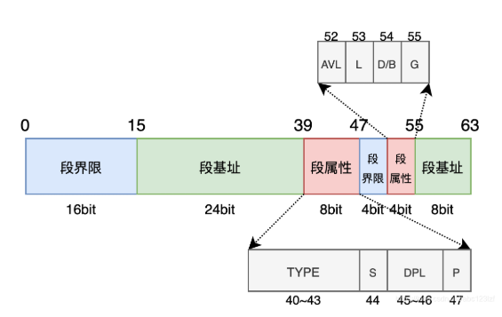

## chapter 1
关键：取址执行


**打开电脑，计算机执行的第一个指令是什么**
操作系统执行第一步骤：把操作系统从磁盘载入内存由操作系统的引导扇区完成BOOTSECT.S

CS：段地址 IP：偏移地址
BIOS的意思：Basic Input Output System
开机时自动加载BIOS，获取基本的输入输出写入内存，作为冯诺依曼的取址的内容;
之后检查RAM,键盘显示器等
0磁道0扇区为操作系统引导扇区
引导扇区代码：
bootsect.s(.s汇编代码)
BOOTSEG = 0x07c0
INITSEG = 0x9000
SETUPSEG = 0x9020
```c
将0x07c0移动到0x9000
start:
    // ax地址寄存器赋值0x07c0, ds数据段寄存器赋值ax
    mov ax, #BOOTSEG mov ds, ax 
    // ax地址寄存器赋值0x9000, 再赋值给es额外段寄存器
    mov ax, #INITSEG mov es, ax
    //设置 CX 为 256，表示接下来将执行 256 次操作
    mov cx, #256
    // 初始化段偏移si和di
    sub si, si       sub di, di
    // 重复移动,ds:si->es:di,执行256次
    rep movw
    // 跳转到INITSEG<<4+go
    jmpi go, INITSEG
```
```c
//CS 是代码段寄存器，表示当前代码所在的段地址。这里将 CS 的值加载到 AX，即获取当前段的地址。
go: mov ax, cs      将当前代码段的段地址cs加载到 ax
//这里的 DS 是数据段寄存器，它被设置为与当前代码段（CS）相同的段地址。通常，代码和数据是分开存放的，但在某些程序中，数据段也可能与代码段相同。
mov ds, ax          将 AX 的值加载到 DS
//同样，ES 是额外段寄存器，这里也被设置为 CS 的地址。这样，ES 和 DS 都指向了同一个段（当前代码段）。
mov es, ax          将 AX 的值加载到 ES
//SS 是堆栈段寄存器，设置为当前段地址。这意味着堆栈也会在当前代码段的地址范围内。
mov ss, ax          将 AX 的值加载到 SS
//SP是堆栈指针寄存器。这里将其设置为 0xFF00，这将确定堆栈的起始位置。堆栈通常从高地址向低地址增长，所以设置为 0xFF00 是一个常见的堆栈初始化方法。
mov sp, #0xff00     将堆栈指针（SP）设置为 0xFF00
load setup:         加载 setup 模块
/*
这些指令准备参数，用于后续的 BIOS 中断调用：
dx 设置为 0x0000。dh磁头号，dl驱动器号
cx 设置为 0x0002，可能表示传输的扇区数或其他相关值。，ch柱面号，cl开始扇区，
bx 设置为 0x0200，是一个偏移值或参数，具体含义取决于上下文。
ax 设置为 0x0200 + SETUPLEN，SETUPLEN 可能是一个常量，表示 setup 模块的长度。
*/
    mov dx, #0x0000     将 0x0000 存入 DX
    mov cx, #0x0002     将 0x0002 存入 CX
    mov bx, #0x0200     将 0x0200 存入 BX
    // ah = 0x02-读磁盘 al = SETUPLEN=4=扇区数量
    mov ax, #0x0200 + SETUPLEN ; 将 0x0200 加上 SETUPLEN 赋值给 AX
//int 0x13 是 BIOS 中断，用于磁盘操作，通常用来读写扇区或控制硬盘。这里调用 int 0x13 可能是为了读取 setup 模块或加载启动代码。
    int 0x13            调用 BIOS 中断 0x13（磁盘操作中断）
    jnc ok_load_setup   如果无进位（无错误），跳转到 ok_load_setup 标签
    mov dx, #0x0000     如果发生错误，重新初始化 DX 为 0
    mov ax, #0x0000     将 AX 设置为 0，通常用于复位
    int 0x13            再次调用 BIOS 中断，可能是为了复位或重试
    j    load setup          重读 setup 模块
```

setup.s完成OS启动前设置
10000~90000之间的数据全部往前平移了10000位
```c
start: 
    xor bh,bh int 0x10    mov [0], dx//取光标位置dx
    // 将ax高八位赋值0x88,调用15终端，将ax值写入内存中的第 2 个字节的位置
    mov ah, #0x88 int 0x15 mov [2] ax
    cli
    mov ad #0x0000 cld
do move:mov es,ax add ax,#0x1000
// 比较ax寄存器是否=0x9000，如果是跳转到end_move结束移动操作
    cmp ax, #0x9000     jz end_move
// ax的值加载到ds寄存器,将数据段设置为ax的值；清零di
    mov ds,ax   sub di, di
// 清零si
    sub si, si
// cx寄存器设置为0x8000作为计数器
    mov cx #0x8000
// 重复将ds:si移动到es:di，移动0x8000个字即0x10000字节即从0x10000~0x20000->0x00000~0x10000
// 下此循环就是从0x20000~0x30000->0x10000~0x20000
    rep 
    movsw
    jmp do_move
```
**之前将0x07c0段处移到0x9000段处就是为了腾出0地址往上空见**

### 进行保护模式
```c
call empty_8042
...
mov ax. #0x0001 mov cr0, ax
jmpi 0, 8
```
设置cr0寄存器进入**保护模式**
在实模式中，CPU通过段地址和段偏移量寻址。其中段地址保存到段寄存器，包含：CS、SS、DS、ES、FS、GS。段偏移量可以保存到IP、BX、SI、DI寄存器。在汇编代码mov ds:[si], ax中，会将AX寄存器的数据写入到物理内存地址DS * 16 + SI中。

而在保护模式下，也是通过段寄存器和段偏移量寻址，但是此时段寄存器保存的数据意义不同了。
此时的CS和SS寄存器后13位相当于GDT表中某个描述符的索引，即段选择子。第2位存储了TI值（0代表GDT，1代表LDT），第0、1位存储了当前的特权级（CPL）。

首先CPU需要查找GDT在内存中位置，GDT的位置从GDTR寄存器中直接获取
然后根据DS寄存器得到目标段描述符的物理地址
计算出描述符中的段基址的值加上SI寄存器存储的偏移量的结果，该结果为目标物理地址
将AX寄存器中的数据写入到目标物理地址
### gdt
cs:ip的寻址模式：
实模式下：cs左移4位+ip;
保护模式下:根据cs查表+ip
