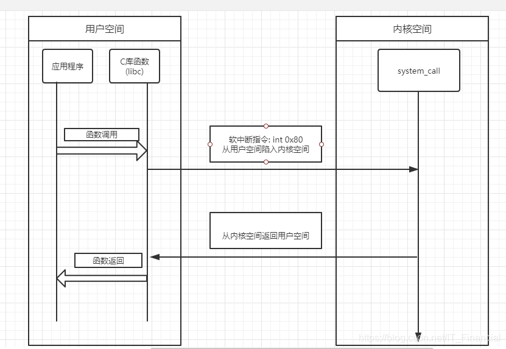
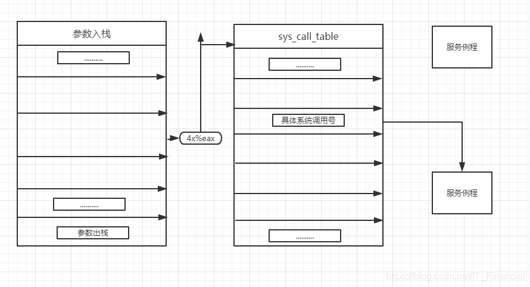
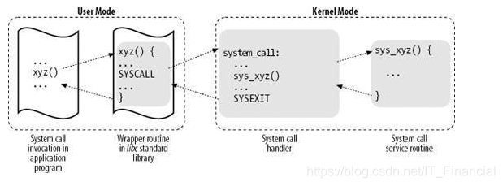
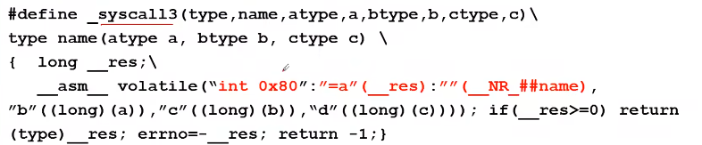
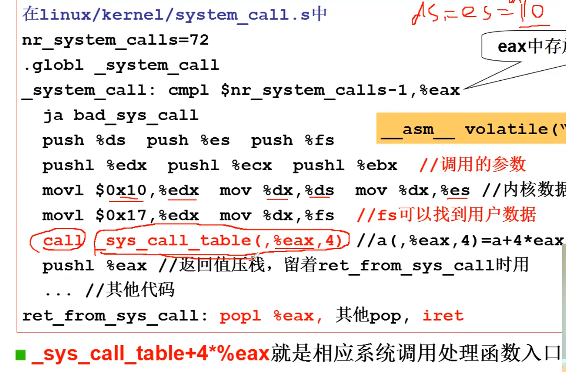
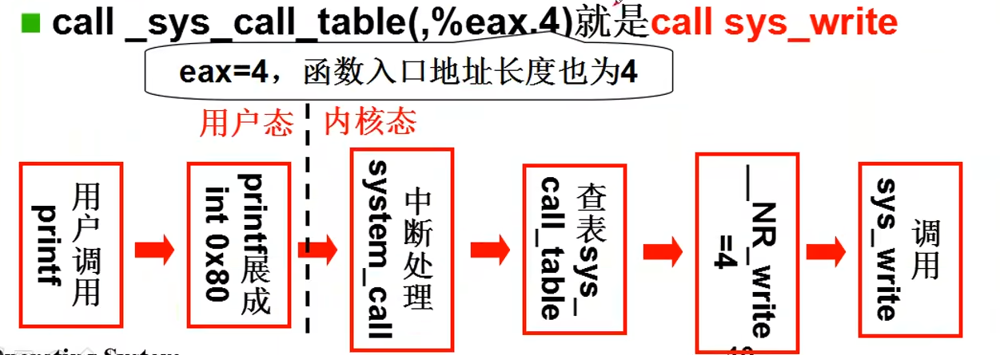

## 操作系统接口
操作系统的接口是一系列对操作系统硬件的使用函数，表现为函数调用又由系统提供，成为**系统调用**
* 连接硬件和用户
* 屏蔽细节操作
  
用户如何使用计算机？
1. 命令行
2. 图形按钮
3. 应用程序

命令是什么？命令输入后发生了什么？
**命令**:一段程序
shell也是一段程序，即/bin/sh
**shell**
```c
int main(int argc,char *argv[]){
    char cmd[20];
    while(1){
        scanf("%s", cmd);
        if(!fork())
            exec(cmd);
        else
            wait();
    }
}
fork和exec是对cpu的使用函数
scanf是对键盘的使用函数
printf是对显示器的使用函数(printf是标准库函数不是系统调用函数)
```
### 图形界面
**图形界面处理机制**：
捕捉鼠标事件中断->放入消息队列->读取消息队列->执行消息对应函数 (类似QT)

###  系统调用
**POSIX**:Portable Opeating System Interfacce of Unix
IEEE指定的一个标准族
|分类|POSIX定义|描述|
|----|----|----|
|任务管理|fork<br>execl<br>pthread_ceate|创建一个进程<br>运行一个可执行程序<br>创建一个线程|
|文件系统|open<br>EACCES<br>mode_t st_mode|打开一个文件或目录<br>返回值，表示没有权限<br>文件头结构：文件属性|

## 系统调用如何实现
### 实现一个whoami系统调用
```c
void main(){
    whoami();
}
```
* 用户程序调用whoami,一个字符串"your_hostname"放在从操作系统中(系统引导时载入)，取出来打印
* 用户程序不能随意的调用数据，不能随意jmp；
* 系统调用可以看到root密码，可以修改它
* 系统调用可以通过显存看到别人word内容

### 为什么要区分内核态和用户态
在GDT表中存贮着特权级别，代表当前指令是用户态还是内核态。
在**内核态**中，CPU允许执行敏感的特权指令，例如直接访问硬件、管理内存页表、控制中断等。

在**用户态**中，这些操作被严格禁止。如果用户程序可以随意切换状态并执行特权指令，系统的安全性和稳定性将无法保证。

区分内核态和用户态：一种处理器"硬件设计":
  * 当前程序执行在什么态(哪层环)?由于CS:IP是当前指令，所以用CS的最低两位来表示：**0是内核态，3是用户态，称为CPL:当前特权等级**
      
  * 在GDT表中，每个段都有一个DPL位，DPL表示段或门的特权级。它被存储在段描述符或者门描述符的DPL字段中。
  * CPL（Current ~）：进程运行时，存储在代码段寄存器CS（而非其他段寄存器）的低两位（即RPL）中，描述了当前进程的特权级。
  * 当当前代码段试图访问一个段或者门（这里大家先把门看成跟段一样），DPL将会和CPL以及段或者门选择子的RPL相比较，根据段或者门类型的不同，DPL将会区别对待。

### 硬件也提供了主动进入内核的方法
中断：int
int指令使CS中的CPL改为0，进入内核
这是用户进入内核的唯一方式




系统调用执行的流程如下：
    (1) 应用程序代码调用系统调用(xyz)，该函数是一个包装系统调用的库函数；

    (2) 库函数(xyz)负责准备向内核传递的参数，并触发软中断以切换到内核；

    (3) CPU被软中断打断后，执行中断处理函数，即系统调用处理函数(system_call)；

    (4) 系统调用处理函数调用系统调用服务例程(sys_xyz)，真正开始处理该系统调用；

系统调用的核心：
(1) 用户程序中包含一段含**系统调用**的代码
(2) 操作系统写中断处理，获取想调程序的编号
(3) 系统调用根据编号执行响应代码


```c
#define syscall3(type, name, atype, a, btype b, ctype c)\
type name(atype a, btype b, ctype c)\
{
    long _res;\
    __asm__volatile("int 0x80":"=a"(_res):""(__NR_##name),// "=a"值eax，返回值放入eax
    "b"((long) (a)), "c" ((long)(b)), "d"((long)(c))));if(__res>=0) return (type)__res; errno=-__res; return -1;
}
```
#### C内敛汇编
带有C/C++表达式的内联汇编格式为：
```c
　　asm　volatile(“Instruction List” : Output : Input : Clobber/Modify);
```
__asm__或asm 用来声明一个内联汇编表达式，所以任何一个内联汇编表达式都是以它开头的，是必不可少的。

Instruction List 是汇编指令序列。它可以是空的，比如：asm volatile(“”); 或 asm (“”);都是完全合法的内联汇编表达式，只不过这两条语句没有什么意义。但并非所有Instruction List 为空的内联汇编表达式都是没有意义的，比如：asm (“”:::“memory”);
　　就非常有意义，它向GCC 声明：“内存作了改动”，GCC 在编译的时候，会将此因素考虑进去。 

Output 用来指定当前内联汇编语句的输出

Input 域的内容用来指定当前内联汇编语句的输入
Output和Input中，格式为形如“constraint”(variable)的列表(逗号分隔)

Clobber/Modify
　　有时候，你想通知GCC当前内联汇编语句可能会对某些寄存器或内存进行修改，希望GCC在编译时能够将这一点考虑进去。那么你就可以在Clobber/Modify域声明这些寄存器或内存。

**接收__NR_write，a,b,c三个参数，然后执行ox80中断，__NR_write是系统调用号，执行对应函数，eax放在返回值中。**

### IDT表
系统初始化中，通过set_system_gate初始化了一个IDT表，并在初始化的时候将0x80中断的DPL设置为3，可以让用户态调用。进入中断后，中断程序的CPL为0，进入内核态执行system_call;
通过调用sys_call_table(%eax, 4)来在一个函数指针数组中查找对应的eax的系统调用函数


