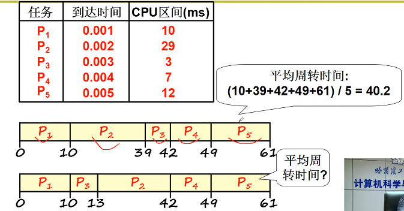

## IO/磁盘/文件/CPU多进程
温故:操作系统如何管理硬件：用过用户程序切入操作系统系统调用，通过系统调用调用内核资源

**程序（Program）**：程序只是静态的指令和数据集合（存储在磁盘上的可执行文件），本身不具备执行能力。
**进程（Process）**：进程是程序的执行实例，是动态运行的实体，包括代码、数据、寄存器、堆栈等，具备独立的运行环境。

一个CPU上交替执行多个程序：**并发**
记录现场：在程序交替时需要保存离开时程序所用的寄存器等现场，因此每个程序有了一个存放信息的结构：PCB

### 多进程图像
main函数创建一个shell,shell启动其他进程
```c
int main(int argc, char* argv[]){
    while(1){
        scanf("%s", cmd);
        if(!fork()){
            exec(cmd);
        }
        wait();
    }
}
```
#### 如何组织多进程
操作系统管理进程的核心就是PCB(Process Conrol Block),用来记录进程信息的数据结构。组织多个进程就是要创建多个PCB，并用合适的数据结构将他们组织起来。每个进程有在不同时期因为不同原因会有不同的状态，如阻塞，就绪，运行，新建，终止。
状态机，将PCB放在不同的队列中，推进队列组织进程

#### 进程交替
```c
// 启动磁盘读写
pCur.state = 'W';
// 将pCur放到DiskWaitQueue
schedule();

schedule(){
    pNew = getNext(ReadyQueue);
    switch_to(pCur,pNew);
}
```
交替的三个部分：队列操作+调度+切换
就是进程调度，他是一个很深刻的话题，有很多复杂的算法
简单来说就是FIFO和Priority：前者是使用先入先出的思想，后者就是规定了优先级，谁的优先级高就会先执行谁。
```c
switch_to(pCur,pNew)
{
    // 保存现在的进程，退出
	pCur.ax = CPU.ax;
	pCur.bx = CPU.bx;
	------
	pCur.cs = CPU.cs;
	pCur.retpc = CPU.pc;
//==============================
    // 加载新的进程
	CPU.ax = pNew.ax;
	CPU.bx = pNew.bx;
	----
	CPU.cs = pNew.cs;
	CPU.retpc = pNew.pc;
}
```
这段伪代码其实就是让旧的阻塞了的进程让出CPU使用权，把现场保存起来，再将CPU使用权交给调度算法提取出来的新进程，新进程的现场要恢复到CPU上去。实现上就是PCB信息互相的交换。由于这个过程需要精细地控制，所以需要使用汇编去实现
#### 多进程冲突问题
多个进程同时存在于内存中会出现下面的问题：
如果两个进程在同一块内存中，进程一代码中会修改进程二的地址，
很有可能进程二就会崩溃。

解决办法：限制对地址100的读写
基本思想就是多进程的地址空间分离。
简单来说就是每个进程都配备一个内存映射表，每个内存映射表又不相同，这样设计出来的不同进程在访问同一块地址时会访问到不同的地址上去，如图中的780和1280，实现了内存地址的分离，进程执行时就能共存。
#### 多进程并发管理
**锁**
解决生产者-消费者模型中某一方执行时被中断而导致counter含义出错的重要方法就是锁机制，即在某一方执行时将counter上锁，保证操作的完整性，操作完全结束时才允许另一方去更改counter：

### 线程
进程切换：切换指令序列+切换内存资源
**进程=资源+指令执行序列**
* 将资源和指令执行分开
* 一个资源+多个指令执行序列

如果只切换指令序列保留内存资源：
多个指令执行序列就是多个线程，共享一个内存映射
**线程既保留了并发的优点，又避免了进程切换的代价**

#### 用户级线程
线程是在一个地址空间下启动并交替执行多个程序，交替执行的多个线程可以由操作系统管理，也可以由用户程序自己管理。用户态线程和内核态线程的判断以线程控制块（TCB）所处的位置为依据：位于操作系统内核叫内核态实现，位于用户层叫用户态实现。
执行程序所需要的资源已经在创建进程时分配好了，此时启动多个执行序列所需要的TCB和用户栈等信息完全可以由应用程序自己编程实现，由应用程序负责操控多个执行序列，对操作系统而言完全透明操作系统完全不知道这些线程的存在，这样的线程被称为用户级线程。如POSIX线程库。相应地，由操作系统管理的线程是内核级线程。

注：进程不存在用户级，因为进程是在 CPU 上实现并发（多道编程），而 CPU 是由操作系统管理的，因此，进程的实现只能由操作系统内核来控制，不存在用户态实现的情况。
#### 切换指令序列
```c
// 获取文本图片数据
pthread_create(..., GetData, URL, buffer);
// 显示出来
pthread_create(..., Show, buffer);

void GetData(char *URL, char *p){...};
void show(char *p){...};
```
这里创建了两个线程，一个用于获取浏览器的数据，一个显示出来，如何做到先获取文本数据，显示文本数据，再获取图像数据，显示图像数据？
**yield()函数主动切换线程，是用户程序**


**问题**:多个线程公用一个栈，会导致压栈出栈混乱
解决办法：每个指令序列一个栈,yield的切换要先切换指令序列栈，再压栈出栈：**TCB**
线程控制块（TCB，Thread Control Block）是操作系统（尤其是多线程系统）中用于管理线程信息的数据结构。它记录了线程的执行状态、寄存器值、栈指针、优先级等关键信息，使操作系统能够正确地进行线程调度（Thread Scheduling）和上下文切换（Context Switching）。

这里线程1压栈104,204转到线程2的300，线程2压栈304,404跳回线程1的204,在B()的大括号又弹出204，这里应该为B函数结束返回104；根本原因是yield结束后没有弹出204；
**解决办法**：将Yield的jmp204去掉，因为yield已经将函数后的返回地址压栈，切换到TCB1通过yield的右大括号弹出返回地址
**esp:栈指针**
```c
Yield() {
    tcb2.esp = 2004;        // 线程 2 的 TCB 保存线程 2 下一个将要执行的指令的位置
    esp = 1004;             // 将线程 1 中保存的下一个将要执行的指令的位置复原到 CPU 的 esp 寄存器中
}
```
```c
void ThreadCreate(A){
    // 申请一个tcb空间
    TCB *tcb = malloc();
    // 申请一个栈空间
    *stack = malloc();
    *stack = A;//100,函数入栈
    // 关联tcb和栈
    tcb.esp = stack；
}
```
用户级线程的缺点：

因为内核看不到用户级线程，如果线程1在内核态阻塞，内核调度就会运行进程2，其余线程不会执行。

### 内核级线程
多核cpu要想真正发挥作用，必须支持核心级线程

内核级线程与用户级线程相似，是操作系统在一套进程资源下创建的，可以并发执行的多个执行序列，操作系统自己创建TCB等数据结构。
MMU是CPU 内部的一个硬件模块，负责虚拟地址到物理地址的转换，同时管理内存保护和访问权限。多核CPU公用一套MMU，共享一块内存资源
并发：同时出发交替执行
并行: 同时出发同时执行

用户级线程的切换，主要分为三步：
TCB 切换
根据 TCB 中存储的栈指针完成用户栈切换
根据用户栈中压入函数返回地址完成 PC 指针切换

为什么要有用户栈和内核栈？
因为操作系统分为用户态和内核态，在线程执行系统调用或发生中断，所要记录的系统参数和返回地址应记录在内核态中，即内核栈。
而用户态函数的局部变量、函数调用帧、返回地址储存在用户栈。

#### 内核级线程的切换

用户调用系统调用的步骤如下：
```c
库函数 --> 库函数中的内嵌汇编 --> int 指令（"int $0x80"） --> 内核的中断处理 set_system_gate(0x80,&system_call) --> system_call --> sys_call_table
```
1. **中断进入**，内核级线程由中断进入，int执行时将当前前用户程序的信息压入内核栈中，如用户栈地址SS:ESP、当前程序执行位置CS:EIP、当前程序现场信息等
2. **进行TCB切换**，调用schedule，如果当前线程进行了磁盘读写等空闲CPU操作，系统会调用schedlue()让出CPU核心：通过将当前线程的TCB状态位改为阻塞，将当前线程的TCB添加到一个等待队列上，然后切换TCB由调度决定
3. **内核栈的切换**，从TCB中取出esp字段赋予当前CPU核心的ESP寄存器，指向调度后个线程的内核栈
4. **中断返回**，切换内核栈后，需要将用户程序现场恢复，由于当前用户现场还是上一个线程的现场，因此需要将调度后线程从步骤3中拿到的内核栈中取出，恢复现场
5. **用户栈切换**，切换现场后，进行用户程序执行，z只需要进行iret执行，iret过程与中断相反，pop出用户栈地址，将 CS:EIP 寄存器设置为当前用户程序执行地址，将 SS:ESP 寄存器设置为当前用户栈地址。完成内核级线程转换


### 实验四
TSS:任务状态段

TSS： Linux0.11中真正完成进程切换是依靠任务状态段(Task State Segment，简称 TSS)的切换来完成的。具体的说，在设计“Intel 架构”(即 x86 系统结构)时，每个任务(进程或线程)都对应一个独立的 TSS，TSS 就是内存中的一个结构体，里面包含了几乎所有的 CPU 寄存器的映像。有一个任务寄存器(Task Register，简称 TR)指向当前进程对应的 TSS 结构体，所谓的 TSS 切换就将 CPU 中几乎所有的寄存器都复制到 TR 指向的那个 TSS 结构体中保存起来，同时找到一个目标 TSS，即要切换到的下一个进程对应的 TSS，将其中存放的寄存器映像“扣在” CPU上，就完成了执行现场的切换。

TR类似于CS，在GDT表中索引到当前TSS描述符，找到TSS段
只需要一条 ljmp 指令就可以完成TSS切换，以下的7个步骤都是CPU解释执行的结果

通过改变选择子来切换线程
```c
#define switch_to(n)
    {struct {long a,b;} tmp;
    __asm__(
    "movw %%dx, %1\n\t"
    "ljmp %0\n\t"
    //ljmp需要传递64字节，包括tmp.a32位，tmp.b32位
    ::"m"(*&__tmp.a),
    "m"(*__tmp.b),
    "d"(__TSS(n)))
    //d 表示将数据传入指定寄存器（在这个例子中是 %%dx 寄存器）。
    }
```

%% 代表 转义字符，表示 真正的 dx 寄存器。
这个 双百分号 (%%) 语法 仅在宏定义或字符串拼接 时使用，避免与 C 代码冲突。

%0、%1、%2 … 代表汇编指令中引用的 操作数（由 : 后的参数提供）。


### 操作系统之“树”
 
### 调度
常见指标：
**响应时间**:从提交请求（或提交进程）到系统开始产生响应的时间。
对于交互式系统，响应时间通常指的是用户发出命令到系统开始执行并反馈结果的时间。
响应时间对交互式系统（如在线系统、桌面应用、命令行界面）至关重要，因为它直接影响到用户的体验。响应时间越短，用户就觉得系统越快。

**周转时间**:从进程提交到进程完成的总时间。
周转时间包括了等待时间、执行时间和系统的调度延迟时间。它比响应时间要更为全面，表示的是整个进程生命周期的时间。
重要性：周转时间对于批处理系统（如长时间运行的任务、后台处理）来说非常重要，因为它衡量了进程从开始到完成的所有时间。

#### 常见调度算法：
**FCFS**:
先来先服务

如果将P2,P3交换，如上图中下面的顺序操作，平均周转时间(10+13+42+49+61)/5=35ms,平均周转时间减小
**SJF**:
短作业优先

短作业优先的平均周转时间是**最小**的。

考虑响应时间：
类似word更关心响应时间
**RR**:
轮转调度

轮转调度保证每个任务都能尽快被响应
counter为时间片有两个作用：
1. 决定每个任务执行的时间
2. counter越大，调度优先级越高


调度程序：
```c
void Schedule(void)
{
    while(1){c=-1; next=0; i=NR_TASKS;
    // 指针赋予数组末尾
    p=&task[NR_TASKS];
    // 如果状态为就绪，且找到counter最大的task
    while(--i){if(*p->state==TASK_RUNNING&&(*p)->counter>c)
        c=(*p)->counter, next=i;}
    if(c) break; //找到了最大的counter
    // 如果counter为0或者阻塞
    for(p=&LAST_TASK;p>&FIRST_TASK;--p)
    // 动态调整：所有counter/2+priority，让就绪counter恢复为初值，阻塞态counter优先级增加
        (*p)->counter=((*p)->counter>>1)
            +(*p)->priority;
    }
    switch_to(next);
}
```
* 对多task的counter做了动态调整，阻塞过的task在恢复就绪态后优先级增加
* 阻塞过的task他的counter会变大，最大小于2priority,保证了counter的界
* 每个进程只需要维护一个变量counter就可以
