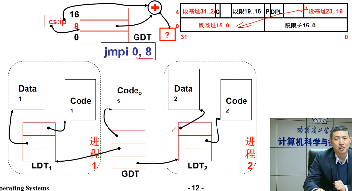
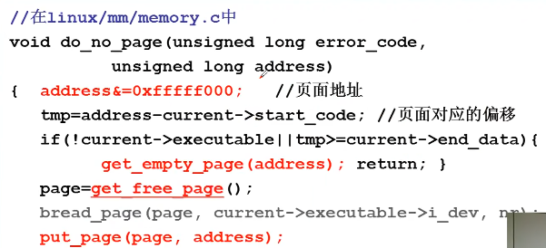
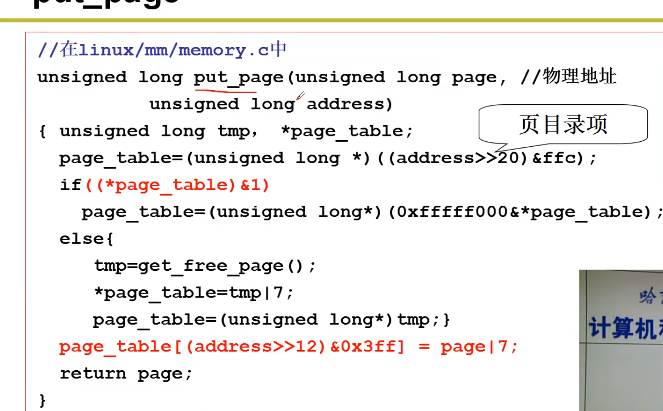
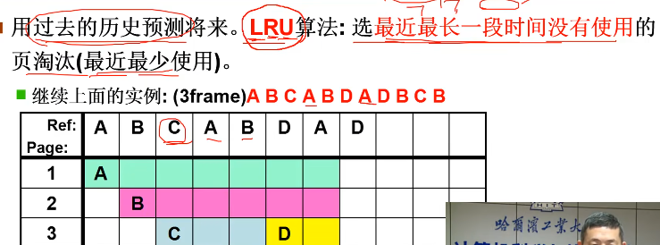
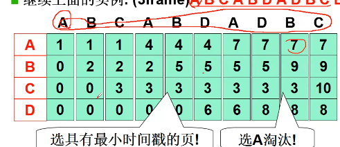
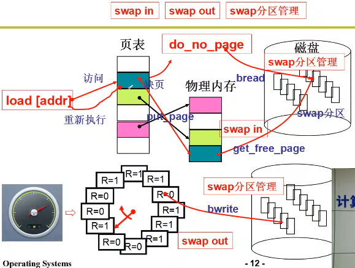

## 内存
### 定义
**页号**是虚拟地址中的一部分，表示虚拟地址空间中的页。虚拟地址空间被划分为若干个页，每个页都有一个对应的页号。
**页框号**是物理内存中实际存储页的一个标识，指代物理内存中的页框（Page Frame）。物理内存也被分为固定大小的块，这些块称为页框（Page Frame）。
### 内存使用方法
```c
.text
_entry://入口地址
    call _main
    call _exit
_main:
    ...
    ret
```
_entry 是程序的入口地址
main 和 _exit 是符号名称，_main是**入口函数**，_exit 通常是程序退出时调用的函数，它负责清理资源并正常退出程序。
汇编指令从磁盘读入内存后，先存如main入口函数地址`call base`，而main表示相对base的地址偏移量(逻辑地址)，CPU只能处理物理地址：base+offset
**解决办法**：重定位，找到一块空闲地址，将逻辑地址+空闲地址基地址base
什么时候重定位：编译时/载入时/运行时
编译时候的空闲地址执行时不一定空闲，在嵌入式系统可以在编译时候重定位
载入时的重定位程序一旦载入内存就不能动了
程序在运行时动态调整自身的内存地址，使其能够在不同地址范围内运行
base地址放在PCB中
#### **交换(swap)**
当进程睡眠时候，进程会存入磁盘的交换区中。
再次换入时候，存放的地址空间改变。
而进程交换中发生的基址变化会存放在PCB中
在运行时候重定位的程序会通过PCB中读取基址进行重定位

创建一个进程
内存找空闲内存
将基址写入PCB
写入内存
CPU取址进行

#### **分段**
实际上程序会被分成若干段：主程序，变量集，函数库，动态数组，栈
不是整个程序，式将各段分别放入内存

具体定位：<短号， 段内偏移>mov [es:bx], ax
这时，重定位需要放每一个段的基址,此时PCB中应为段表(LDT)：


GDT+LDT表：

把程序分段
每个段放入内存中空闲区域
把不同段基址放入LDT
LDT赋给PCB
PC指针取址执行，根据LDT找到内存地址
### 分页分区
如何找到空间内存？
1. 固定分区：操作系统初始化时候将内存等分为k个分区
2. 可变分区：
    


分页：解决内存分区导致的内存效率问题
如果总空闲内存>160K,而没有一个空闲分区>160K，即内存碎片
将空闲分区合并，内存紧缩,但是内存紧缩时候CPU不能工作

针对每个段内存请求，系统一页一页的分配给这个段

此时连续的段被拆分为离散的段，因此引入页表：
每个进程都有自己的页表

`mov [0x2240], %eax`,根据页大小(4k，右移12位，16进制三位)找到页号对余值取址

### 多级页表与快表
为了提高内存空间利用率，页应该小，但是页小了页表就大了
假如内存有4G即$2^{32}$,页表大小为4K，那么页表大小为：$$2^{32}/2^{12}=1M$$，每个页表需要4M内存，如果并发十个进程就需要40M内存，导致内存浪费
而实际上大部分逻辑地址根本不会用到。所以能不能把不使用的页表去掉：

但是如果页表中的页号并不连续，需要比较、查找($O(n)$)、折半($O(log_{2}n)$),每次方位内存都增加了时间复杂度。

**如何既要页表连续又要页表占用内存少？**
多级页表：页目录表+页表

$2^{10}个目录项*4字节地址=4K$
上图中一级页表占了4K内存空间，其中三个二级页表已创建使用，占用了4*3=12K内存空间，其余二级页表未使用为驻留内存并不创建对应二级页表。而且每个二级页表仍为连续的
需要16K远远小于4M

多级页表增加了访存的次数，没多一级就多造成了一次访问的次数。尤其是64位系统

#### 快表
TLB是一组相联快速存储是寄存器。它存在于处理器内部，用于缓存最近访问的虚拟地址到物理地址的映射，从而减少访问页表的时间，提高地址转换的效率。
TLB的工作过程：
1. 查找虚拟地址：当处理器访问一个虚拟地址时，首先会检查该虚拟地址是否存在于TLB中（即检查快表）。如果该虚拟地址的映射已经在TLB中缓存，则可以直接从TLB获取物理地址。

2. 命中（Hit）：如果TLB中存在该虚拟地址的映射，称为TLB命中，处理器可以直接使用TLB提供的物理地址，避免了访问主存中的页表，从而提高了性能。

3. 未命中（Miss）：如果TLB中没有找到该虚拟地址的映射，称为TLB未命中，此时处理器需要访问主存中的页表，进行地址转换。完成转换后，处理器将新的映射添加到TLB中，以便以后访问。

tlb要想命中率高1.表要大，但是昂贵一般是存储64-1000作用
2.
相比$2^{10}$64很小，为什么TLB起作用？
程序的地址访问存在局部性，多体现为循环、顺序结构
   
### 段页结合
现代操作系统中：
物理内存可以认为是一个的物理字节数组，每个物理地址指向这个物理字节数组中的一项。
虚拟地址空间也一样，它也可以认为是一个物理字节数组，不过这个字节数组是存储在磁盘上。
在计算机的虚拟地址空间管理中，当一个段（segment）放入多个页时，这些页不一定是连续的。虚拟地址空间的分页机制设计上允许页与页之间存在间隔，且物理内存中对应的页框（page frame）也可能不连续。
* 虚拟页与物理页的映射：在现代操作系统中，虚拟地址空间被划分为多个大小相同的页（通常为 4KB 或 8KB）。程序的数据、代码、堆栈等可能会跨越多个虚拟页。
* 映射到物理内存：虚拟页并不需要与物理内存中的页框（物理页）按顺序一一对应。即使虚拟页是连续的，它们在物理内存中也可以被映射到非连续的页框。操作系统使用页表来维护虚拟页和物理页框的映射关系，并且这些映射可以是非连续的。

因此，段在虚拟地址空间中的映射是基于页来分配内存的，而虚拟页可以跨越多个物理页框，且这些物理页框不一定是连续的。
注：CPU 在运行指令时，寻址的是虚拟地址空间地址，而不是物理内存地址。
**段面向用户，页面向硬件，因此不同CPU中的地址不一致**
**现代计算机的“段”一般由多个页组成，而这些页的物理地址通常是不连续的，但在虚拟地址空间上看是连续的。**

### 建立内存管理
1. 操作系统加载可执行文件后，创建了一个进程，这个进程就有了自己的虚拟地址空间，进程的虚拟地址空间被统一划分成了多个固定区域，例如代码区，数据区，堆区，共享区，栈区，内核区
2. 操作系统加载可执行文件后，创建了一个进程，这个进程就有了虚拟地址空间，这并不意味着可执行文件已经从磁盘加载到内存中了，操作系统只是为了进程虚拟地址空间的每个区域分配了虚拟页。
3. 操作系统通过mmap()或其他方式，将文件内容映射到程序的虚拟地址空间中。对于程序的代码段和数据段，操作系统会将文件的内容映射到相应的虚拟地址空间
   * 共享库的映射：对于动态链接库（libc.so等），操作系统会将共享库映射到程序的虚拟地址空间地址空间，使得程序可以调用这些库中的函数。
   * 堆和栈的映射：堆和栈的虚拟地址空间被预先分配，但没有对应的物理页，直到程序访问时才会发生实际的物理页分配。
4. 将虚拟地址空间的页与物理地址空间的页建立映射
5. 查找页表：页表（Page Table）存储了虚拟页与物理页框之间的映射关系。每个虚拟页对应一个物理页框。如果虚拟页有对应的物理页框，则直接映射；如果没有（例如页表项为空），则会触发页面缺失（Page Fault）。分配新的物理页，更新页表。

第一步，先创建一个虚拟区域，然后第二步，根据这个虚拟区域来创建一个段表，第三步找到实际的物理地址空间，第四步，创建页表，第五步使用

fork()时候，子进程共享父进程的虚拟地址空间地址，但是另外分配自己的页表，并指向相同的物理地址。
采用写时复制，当父进程或子进程尝试写入某个页，才会复制该页，并分配新的物理地址。只有被修改的页 (0x3000) 发生物理地址变化，其他页仍然共享。

执行程序时，MMU内存管理单元会将虚拟地址空间上的页表+偏移转为物理地址空间的页表+偏移，读写内存数据

### 内存换入
当进程访问一个已被换出的页面：
CPU访问地址->虚拟地址查页表，MMU发现缺页->执行中断请求调页->将页调入内存



### 内存换出
```c
// 找到物理内存中的空闲页，然后换入
page = get_free_page();
bread_page(page, current->executable->i_dev,nr);
```
**但是不是总能有空闲页，内存是有限的**
需要选择将内存中已有页淘汰，如何选择？
1. FIFO先入先出
2. MIN算法，将最远使用的页淘汰

但是MIN需要知道将来的事情
3. LRU(效果最好)


#### LRU实现
每页维护一个时间戳(time stamp),选择具有最小时间戳的页

但是执行一条指令就要去搜索时间戳
**使用页码栈**

将栈底淘汰，栈往下沉，用栈实现也需要修改十次左右栈指针；
**近似LRU/Clock算法**
每个页加一个引用位，访问一次就将该位改为1
当缺页需要换出时：
    扫描，将引用位为1的置为0，继续扫描。为0的淘汰该页；

**缺点：如果缺页很少?**
将1置为0的机会较少，扫描第一次会将大多数页的1置为0，直接进行第二次扫描将按照扫描顺序置出，将会退化为FIFO
**改良：定时清楚R位**
这样会防止导致太长时间不扫描导致大部分页都为1
用来淘汰页的速度要慢
用来清楚R位的速度要快

#### 给进程的页框分配
如何决定一次调入要换入换出多少页框？

分配的多：请求调页导致的内存效率高效利用就没用了
分配的少：CPU利用率会急速下降

系统发生颠簸，不断在磁盘和内存直接数据交换

可以用一些算法解决(求工作集)，也可以用近似算法或者固定分配数量