## 设备驱动
### 输出设备/显示器
计算机如何让外设工作？
 CPU通过总线向外设中的控制寄存器写指令，驱动外设工作

 但是不同的外设，控制寄存器地址不同，内容格式予以不同等；因此操作系统需要给用户提供一个简单视图：文件试图
```
int fd = open("/dev/xxx");
for(int i=0; i < 10; i++){
    write(fd, i, sizeof(int));
}
close(fd);
```
* 无论什么设备，open，write是操作系统给外设的接口
* 根据文件名来决定执行什么操作
```c
//linux/fs/open.c
int sys_open(const char* filename, int flag,){
    // 根据文件名字，配置文件的inode
    i = open_namei(filename, flag, &inode);
    current->filp[fd]=f; //第一个空闲fd
    f->f_mode=inode->i_mode;
    f->node=inode;
    f->f_count=1;
    return fd;
}
```
将文件的文件描述符保存在进程的文件指针数组，其中包含了文件的表示Inode

操作系统通过inode找到对应设备要调用的对应函数


### 输入设备/键盘

键盘的按键操作对于操作系统是一种**中断**
21号中断是键盘的处理终端：
    从端口0x60读取扫描码，
    调用key_table+eax*4
    
根据扫描码找到ascll码,放到缓冲队列


进行回显，将键盘对于ascill码显示到显示器


### 磁盘管理
使用盘块号操作磁盘称为生磁盘
```c
void do_hd_request(void){
    ...hd_out(dev, nsect, sec, head, cyl, WIN_WRITE,..);
    port_write(HD_DATA, CURRENT->buffer, 256);
}
void hd_out(dev, nsect, sec, head, cyl, WIN_WRITE,..)
{
    port = HD_DATA;//数据寄存器端口(0x1f0)
    outb_p(nsect, ++port); // 扇区数
    outb_p(sect, ++port); // 扇区号
    outb_p(cyl, ++port); // 柱面号，port是8位，cyl是十六位，写入低8位
    outb_port(cyl>>8, ++port); // 写入高八位
    //0xA0硬盘命令基值逻辑与上(drive << 4)：表示选择主盘或从盘，head：指定使用的磁头编号
    outb_p(0xA0|(drive<<4)|head, ++port); 
    outb_p(cmd, ++port);
}
```
读取磁盘需要：柱面号，扇区号，扇区数，硬盘控制命令四个参数

#### 通过盘块号读写磁盘(CHS法)
CHS 模式使用 柱面（Cylinder）、磁头（Head）、扇区（Sector） 来定位数据：

柱面号（C）：表示磁盘上的某一组磁道（多个盘面相同磁道组成柱面）。
磁头号（H）：表示使用的盘面（不同的盘面对应不同的磁头）。
扇区号（S）：表示磁道上的扇区编号（从 1 开始）。
每个扇区的大小 一般是 512 字节。
磁盘驱动付责从block计算出cyl,head,sec(CHS)
**如何编址？**
磁盘访问时间=写入控制器时间+寻道时间+旋转时间+传输时间
C、H、S得到的扇区号？
`Block Number = (C × Hs + H) × Ss + (S - 1)`
    * Hs = 每个柱面的磁头数（即盘面的数量）
    * Ss = 每个磁道的扇区数
    * (S - 1) 是因为 扇区编号从 1 开始，而盘块号从 0 开始
假设：

柱面数（C） = 100
磁头数（Hs） = 4
每磁道扇区数（Ss） = 20
目标地址（C=2, H=1, S=5）
```
Block Number = (2 × 4 + 1) × 20 + (5 - 1)
             = (8 + 1) × 20 + 4
             = 9 × 20 + 4
             = 180 + 4
             = 184
```
从盘块也可以倒推出CHS。 
从扇区到盘块:一个盘块一般为扇区的整数倍
每次读写1K:碎片0.5K;读写速度100K1秒;
每次读写1M:碎片0.5M;读写速度约40M/秒

```c 
static void make_request(){
    struct request *req;
    req = request+NR_REQUEST;
    req->sector = bh->b_blocknr<<1;
    add_request(major+blk_dev,req);
}
```
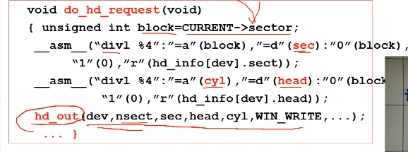

#### 多个进程通过队列使用磁盘
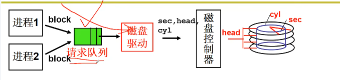
磁盘调度:
1. 平均访问延迟小
2. 寻道时间小
FCFS：先到先用
短寻道优先：优先寻道最小
扫描调度(电梯算法)

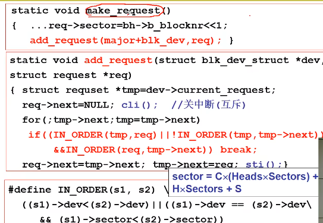
1. 进程得到盘块号，算出扇区号
2. 用扇区号make_req,用电梯算法add_request
3. 进程sleep_on等待中断
4. 磁盘中断处理
5. do_hd_request 算出CHS
6. hd_out调用outp()完成端口写

#### 从生磁盘到文件
文件是盘块的跟高一级抽象
文件：从字符流到盘块集合的映射关系
在连续盘块结构中：
类似数组，同一个文件在盘块中连续排布
例如有个test.c文件：
文件中200-212字符进行修改， 文件中有个FCB(file control block)，记录了文件的文件名，起始块和块数。经过换算(字符数/盘块大小)，能得到对应字符在哪个块的具体位置

**连续结构缺点**：如果文件增大，为了不覆盖相邻文件，需要整个文件挪到其他空闲位置。不适合动态增长

链式结构实现文件：
类似链表，同一个文件可以在不连续的盘块中分布
此时FCB只记录了起始块和文件名
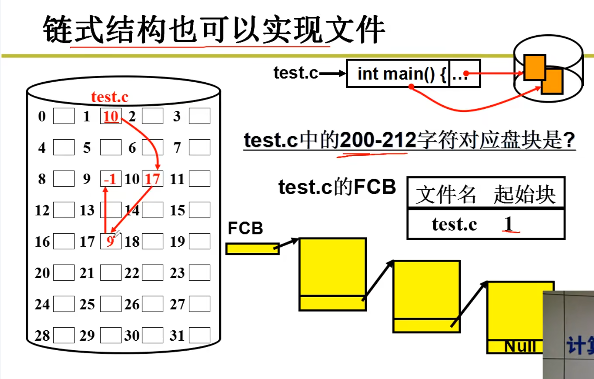
**缺点**：查找只能从第一个盘块开始查找

**索引结构实现文件(最常见)**：
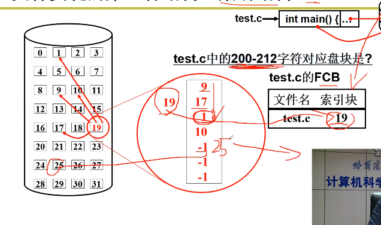
FCB(inode)保存了一个索引块,索引块存放整个文件字符的索引，字符数/盘块大小就可得到在那一块盘块
**多级索引**：
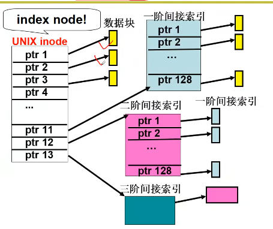
大文件可通过多级索引提高索引速度，可以访问很大文件

#### 文件使用到磁盘实现
sys_write:
获得inode
file_write(inode, file, buf, count)

盘块的分配是在文件写入时动态创建的，而不是文件创建时立即分配所有盘块。
```c
int file_write(struct m_inode *inode, struct file *filp, char *buf, int count)
{   // 获取索引位置
    off_t pos;
    if(filp->f_flags&O_APPEND)
        pos=inode->i_size;
    else
        pos=filp->f_pos;
    // 写入
    while(i<count){
        // 找到/创建对应的block，create=1的b_map,没有映射创建映射
        block = create_block(inode, pos/BLOCK_SIZE);
        // 写入缓存区，放入队列，阻塞等待调度
        bh=bread(inode->i_dev, block);
        // 计算偏移量
        int c = pos%BLOCK_SIZE;
        char *p =BLOCK_SIZE-c;
        pos+=c;
        ...
        while(c-->0)
        // 写入
            *(p++)=get_fs_byte(buf++);
        // 释放缓存区
        brelse(bh);
    }
    // 更新索引
    filp->f_pos=pos; 
}
// 0-6 直接数据块；
// 7 一重间接
// 8 二重间接
struct d_inode{
    unsigned short i_mode;
    ...
    unsigned short i_zone[9];
}
int bmap(m_inode *inode, int block, int create)
{
    // 直接索引
    if(block<7){
        if(create&&!inode->i_zone[block])
        {
            inode->i_zone[block]=new_block(inode->i_dev);
            inode->i_ctime=CURRENT_TIME;
            inode->i_dirt=1;
        }
        return inode->i_zone[block];
    }
    // 一次简介索引，8-519，先读取一重间接
    block-=7;
    // linux0.11中，磁盘块大小为1024字节，一个磁盘块可以存放512个16bit物理块号，所以一个间接索引块可以映射512个数据块，所以文件大小最少为512*1024；
    // 最大磁盘:2^16*1024=65536K=64M
    if(block<512){
        // 先读取一重索引
        bh=bread(inode->i_dev, inode->i_zone[7]);
        // 找到所要写的block物理块号
        return (bh->b_data)[block];
    }
    ...
}
```
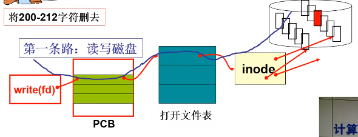
### 文件管理系统
当一个存储介质（如硬盘、SSD、U盘）被格式化时，会创建一个文件系统，并在存储设备上划分出不同的区域：

引导区（Boot Sector）：存储引导信息（如 MBR、GPT）。
超级块（Superblock）：记录整个文件系统的元数据，包括块大小、inode 总数等。
索引节点（inode 表）：存储文件和目录的元数据，如权限、大小、时间戳等。
数据块（Data Blocks）：实际存储文件数据的区域。

从文件名到inode的映射：如何从text.c找到Inode
将整个磁盘变为一个目录树。
目录树：将整个的磁盘文件树状划分
k次划分后，每个集合文件数：$O(log_kN)$，目录：表示一个文件集合
* 可扩展性好，表示清晰，最常用；

上面内容我们使用文件需要先得到他的FCB(inode),在目录结构中，路径定位文件并找到文件的inode
#### 目录实现
**如何根据路径名找到FCB?**
首先从根目录开始，根目录在硬盘初始化时候固定，放在第1个位置。
通过根目录i_zone(数据块)，找到目录下各个文件的文件名+FCB索引
方式一：把一个目录的所有FCB全保存下来，但是需要将所有FCB存在内存中然后匹配
方式二：通过记录文件名+FCB的索引
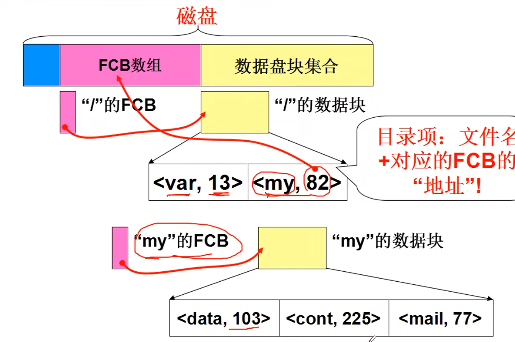

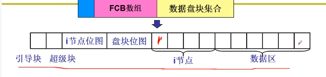
inode位图，哪些inode空闲，哪些被占用
盘块位图：哪些盘块空闲，磁盘大小不同盘块位图大小不同
超级块：记录两个位图有多大的信息(mount挂载的是超级块)
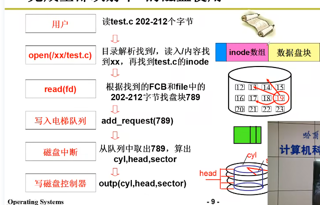

#### code
```c
int sys_open(const char *filename, int flag)
{
    i = open_namei(filename, flag, &inode);
    ...
}
int open_namei(filename, flag, &inode)
{
    dir = dir_namei(pathname, &namelen, &basename);
}

static struct m_inode *dir_namei()
{
    dir = get_dir(pathname);
}
// dir_namei() 通过 get_dir(pathname) 解析路径，获取目录的 inode。
statc struct m_inode *get_dir(const char *pathname)
{
    //如果/开头，从根目录开始，否则从当前目录开始
    if((c = get_fs_byte(pathnmae))=='/')
    {
        inode = current->root;
        pathname++;
    }
    else if(c)
        inode = current->pwd;
    // 从
    while(1){
        if(!c)
            return inode;//函数的正确出口
        // 从inode对应目录查找thisname,目录项de->inode记录了下一级inode号
        bh = find_entry(&inode, thisname, namelen, &de);
        int inr = de->inode;
        int idev = inode->idev;
        // 根据目录项读取下一层inode
        inode = iget(idev, inr);
    }
}
```
根目录如何获得：
```c
void init(void){
    setup(void *) &drive_info;
    ...
}
sys_setup(void *BIOS)
{
    hd_info[drive].head = *(2+BIOS);
    hd_info[drive].sect = *(14+BIOS);
    mount_root();
}
void mount_root(void)
{
    //ROOT_DEV初始设备，ROOT_INO根目录inode编号，获得根目录FCB(inode)
    mi = iget(ROOT_DEV, ROOT_INO);
    // 根目录指向根目录inode
    current->root = mi;
}
```
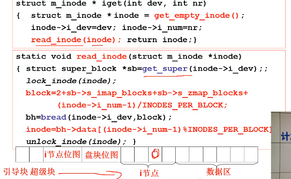
获得超级块，略过引导块的2和