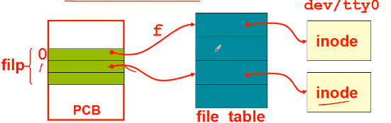
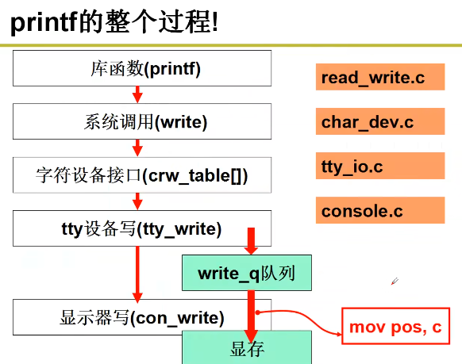
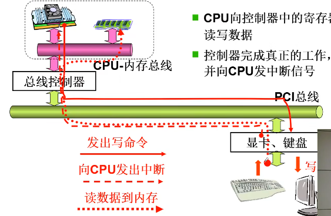
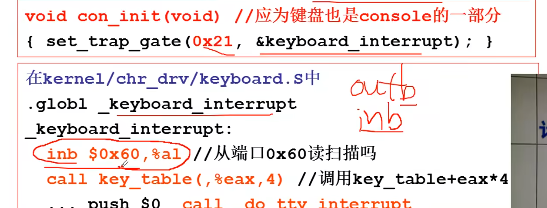
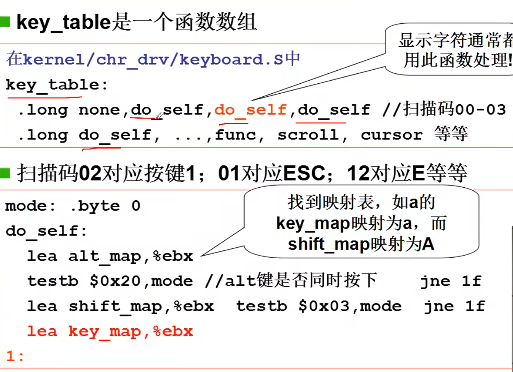
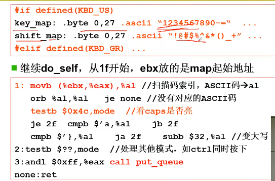
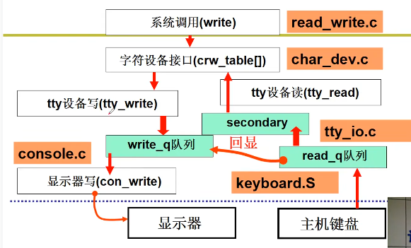

## 设备驱动
### 输出设备/显示器
计算机如何让外设工作？
 CPU通过总线向外设中的控制寄存器写指令，驱动外设工作

 但是不同的外设，控制寄存器地址不同，内容格式予以不同等；因此操作系统需要给用户提供一个简单视图：文件试图
```
int fd = open("/dev/xxx");
for(int i=0; i < 10; i++){
    write(fd, i, sizeof(int));
}
close(fd);
```
* 无论什么设备，open，write是操作系统给外设的接口
* 根据文件名来决定执行什么操作
```c
//linux/fs/open.c
int sys_open(const char* filename, int flag,){
    // 根据文件名字，配置文件的inode
    i = open_namei(filename, flag, &inode);
    current->filp[fd]=f; //第一个空闲fd
    f->f_mode=inode->i_mode;
    f->node=inode;
    f->f_count=1;
    return fd;
}
```
将文件的文件描述符保存在进程的文件指针数组，其中包含了文件的表示Inode

操作系统通过inode找到对应设备要调用的对应函数


### 输入设备/键盘

键盘的按键操作对于操作系统是一种**中断**
21号中断是键盘的处理终端：
    从端口0x60读取扫描码，
    调用key_table+eax*4
    
根据扫描码找到ascll码,放到缓冲队列


进行回显，将键盘对于ascill码显示到显示器

