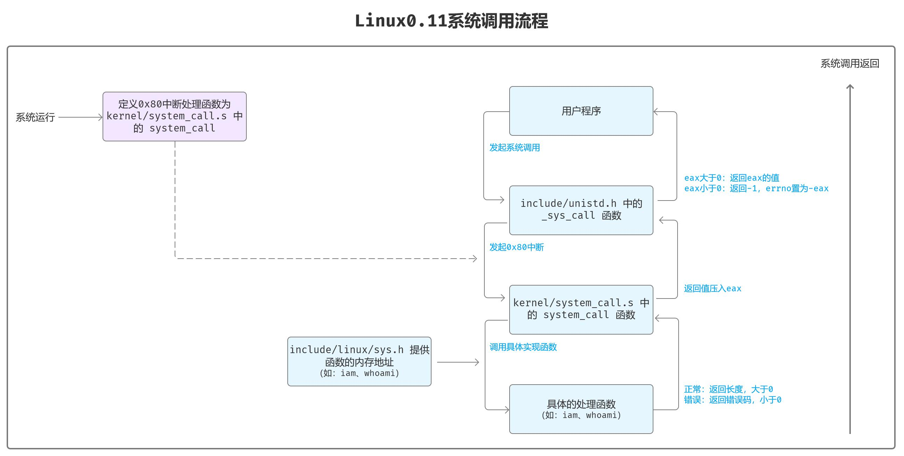

## 系统调用
### 复习：
#### ​汇编与C交互：如何通过栈传递参数调用C函数。
在调用函数前，汇编代码保存用户态的寄存器（避免被C函数覆盖）：
```asm
system_call:
/* 保存用户态寄存器，将用户态的ds,es,fs压入栈*/
push %ds
push %es
push %fs
/* 压入EDX、ECX、EBX，作为参数传递给系统调用*/
pushl %edx        ; 第三个参数（右数第一个）
pushl %ecx        ; 第二个参数
pushl %ebx        ; 第一个参数（右数第三个）

/*切换 ds、es 到内核数据段，确保内核访问正确的内存空间。*/
/* 将32位立即数0x10（十进制16）赋值给edx */
movl $0x10, %edx
/* 将edx的低16位（dx=0x0010）赋值给ds段寄存器 */
mov %dx, %ds
/* 将dx的值（0x0010）赋值给es段寄存器 */
mov %dx, %es
......
call sys_call_table(, %eax, 4) // 调用系统调用处理函数返回值储存在eax
pushl %eax // 保存返回值
/* 检查当前系统状态 */
movl current, %eax
cmpl $0, state(%eax)
jne reschedule
/* 检查时间片 */
cmpl $0, counter(%eax)
je reschedule
```

修改：
1. unistd.h头文件中：
```c
#define __NR_iam    72      // iam 系统调用号
#define __NR_whoami 73      // whoami 系统调用号
```
2. system_call.s
在 kernel/system_call.s 中，_system_call例程是0x80的入口处理过程，在_system_call中，会先检测调用号是否超出系统调用总数（nr_system_calls），所以需要修改这个系统调用总数。
`nr_system_calls = 74`
3. include/linux/sys.h
sys_call_table中要增加对应的系统调用
```c
extern int sys_iam();
extern int sys_whoami();
```
4. 函数实现
修改完头文件后就要增加函数实现，在Linux0.11中函数实现是在kernel目录中：
借鉴下别人的源码：
```c
#define __LIBRARY__      // 定义一个符号常量，见下行说明。
#include <unistd.h>      // Linux 标准头文件。定义了各种符号常数和类型，并申明了各种函数。如果定义了__LIBRARY__，则还含系统调用号和内嵌汇编 syscall0()等。
#include <errno.h>       // 错误号头文件。包含系统中各种出错号。(Linus 从 minix 中引进的)。包含了 EINVAL 错误码的定义。
#include <string.h>      // 字符串头文件。主要定义了一些有关字符串操作的嵌入函数。其中包含了 strlen、strcpy 函数。
#include <asm/segment.h> // 段操作头文件。定义了有关段寄存器操作的嵌入式汇编函数。其中包含了 get_fs_byte 和 put_fs_byte 函数

char buffer[24]; // 声明一个缓冲区，用来保存用户程序输入的name，23个字符 +'\0' = 24

/*
 * 将name的内容拷贝到buffer，name的长度不超过23个字符。
 * 返回：拷贝的字符数。如果name的字符个数超过了23,则返回-1，并置errno为EINVAL。
 */
int sys_iam(const char *name)
{
    /*
        一开始我想直接用strlen计算name的长度，用strcpy复制name到buffer中。
        但是不能这样操作，因为name的位置在用户程序段，用户程序段需要用fs进行操作。
        strlen和strcpy都是默认用内核数据段ds和es进行操作。
    */
    // int len = strlen(name);
    // strcpy(buffer, name);

    /*
        直接打印name也是不行的，因为printk只能打印内核数据段内的数据，而name的位置是在用户程序段。
     */
    // printk("name=%s\n", name);

    /* 下面将name复制到tmp中 */
    int i;        // i用作字符串索引
    char tmp[25]; // 临时存储输入字符串，操作失败时不影响buffer，比buffer的长度多1，即可校验长度是否超出。
    for (i = 0; i < 25; i++)
    {
        tmp[i] = get_fs_byte(name + i); // 从用户程序内存取得数据，fs指向用户程序段，name是在用户程序段中的起始偏移位置
        if (tmp[i] == '\0')             // 字符串结束
            break;
    }
    printk("tmp=%s\n", tmp); // 调试打印tmp内容

    /* 判断输入的长度是否超过23 */
    int len = strlen(tmp); // tmp位于内核中，所以可以直接用strlen计算长度。
    if (len > 23)          // 字符长度大于23个
    {
        printk("The length of name is greater than 23!\n");
        return -EINVAL; // 置errno为EINVAL，返回“­-1”。具体实现见include/unistd.h中的_syscalln宏。
    }

    /* 将tmp复制到buffer中 */
    strcpy(buffer, tmp);
    printk("buffer=%s\n", buffer); // 调试打印buffer内容。不知道为什么这里打印不出来，但实际上buffer是有内容的。

    /* 返回长度 */
    return len;
}

/*
 * 将buffer拷贝到name指向的用户地址空间中,确保不会对name越界访存(name的大小由size说明)
 * 返回：拷贝的字符数。如果size小于需要的空间,则返回“­-1”,并置errno为EINVAL。
 */
int sys_whoami(char *name, unsigned int size)
{
    /* 先校验buffer长度是否超过size，size为name的长度 */
    int len = strlen(buffer);
    if (len > size)
    {
        return -EINVAL; // 置errno为EINVAL，返回“­-1”。具体实现见include/unistd.h中的_syscalln宏。
    }

    /* 把 buffer 输出至 name */
    int i;
    for (i = 0; i < size; i++)
    {
        put_fs_byte(buffer[i], name + i); // 将buffer逐个字节写入到用户程序段内name起始的位置。fs指向用户程序段，name是在用户程序段中的起始偏移位置
        if (buffer[i] == '\0')            // 字符串结束
            break;
    }

    return len;
}
```
与普通C语言程序开发相比，要知道的操作系统知识有：
    用户程序段如何获得以及用户名称的未知

4. 修改cmake
在OBJ中添加`who.o`
5. 调试
    调试设计挂载的知识，以后再填坑吧

   